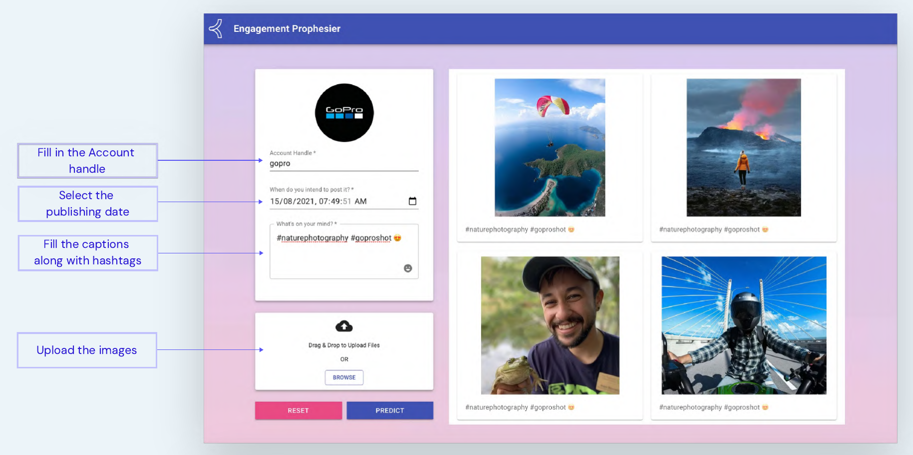
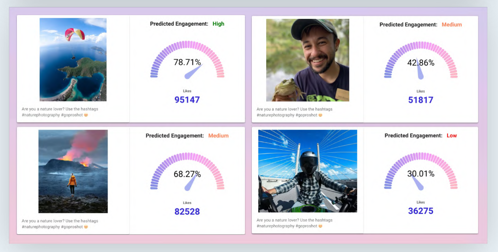
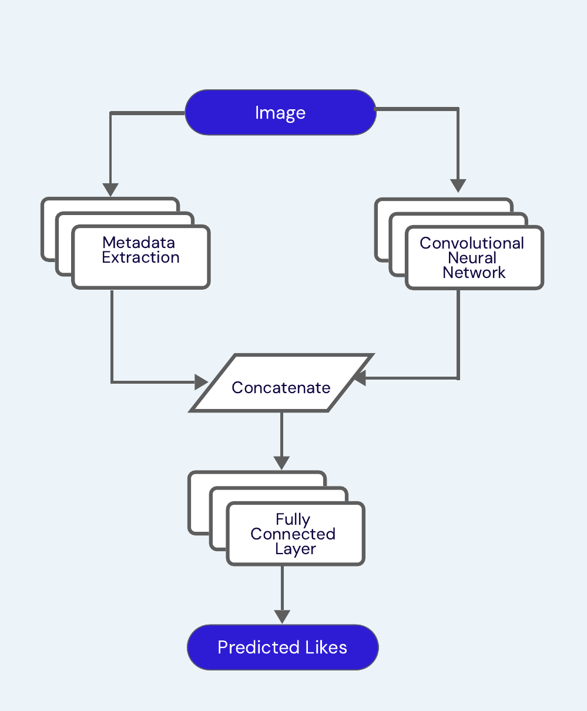

# Engagement Prophesier

> Predict social media engagement *before* you publish.

Engagement Prophesier is an AI-powered image engagement predictor for social media. It enables marketers to select the most engaging image from a set of options by analyzing visual and metadata attributes using a deep learning model.
---

## 📌 Overview

Social media is saturated with content, and choosing the right image can significantly impact audience engagement. Engagement Prophesier uses machine learning to recommend the best-performing image from a set of candidates, eliminating human bias and guesswork.

---

## 🧠 Features

- 📊 **AI-driven prediction** of likes and engagement levels for each image
- ⚖️ **Bias-free selection** based on data insights, not subjective judgment
- 💸 **Revenue optimization** by increasing post performance
- ⏱ **Time-saving tool** for marketing/designing teams

---

## 🖼️ Screenshots

### 📥 How to Use the Tool

Upload candidate images, add hashtags and captions, and hit "Predict".

---

### 📊 Prediction Results

Each image receives a predicted engagement score and like count.

---

### 📉 Visual Engagement Impact Example

Image B gets ~30x more likes than Image A – visuals matter!

---

### ⚙️ AI/ML Model Architecture**

---

## 🔧 Tech Stack

### Backend
- **Framework:** FastAPI
- **ML Libraries:** Keras, NumPy, Pandas
- **Model:** CNN for image features + Fully Connected Layer for metadata
- **Deployment:** AWS Kubernetes cluster

### Frontend
- **Framework:** React.js 
- 🎨 [Frontend Repo](https://github.com/PriyaBarnwal/Prophesier-frontend)

---

## 🛠️ How It Works

1. **Upload** up to 4 images
2. **Add** captions and hashtags
3. **Select** publishing account and date
4. **Predict** engagement per image
5. **Post** the best one

---

## 👨‍👩‍👧 Team

- Priyanka Barnwal  
- Prashant Gupta  
- Pradeep Gowda  
- Debojit Banik

---

## 🙌 Acknowledgements

Built lika a POC for a hackathon as part of the KHoders initiative at Khoros, Bangalore.
